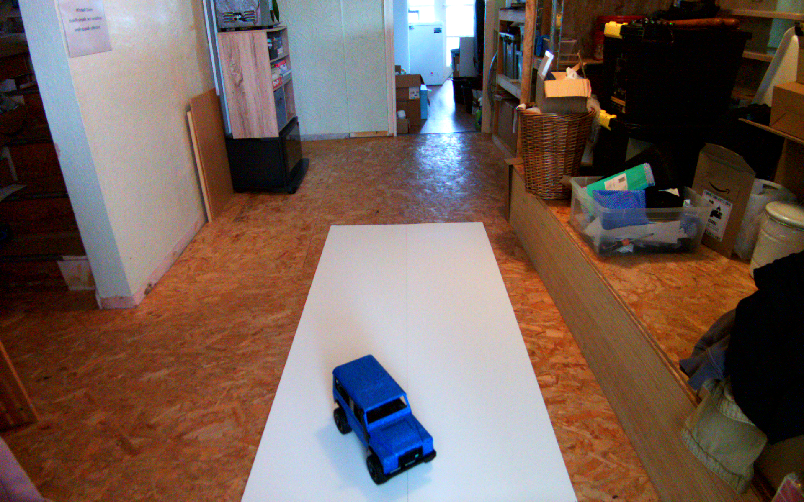
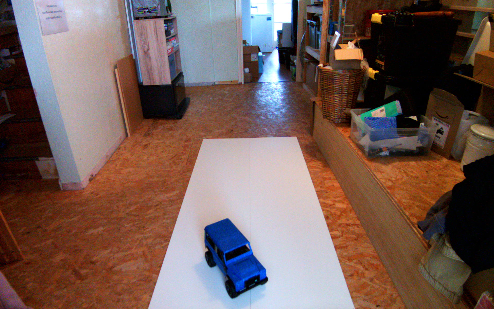
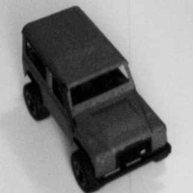
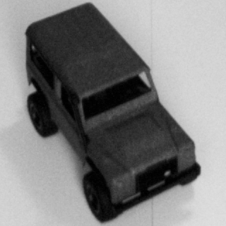
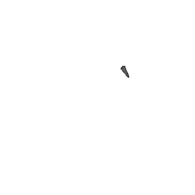
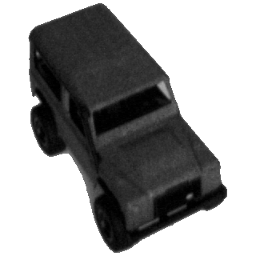

# Failure Analysis Report: Live Distance Regression Spike

**Incident:** `incident_1`
**System:** bounded monocular perception, live inference v0.3
**Date analysed:** 2026-05-18
**Status:** Root cause identified; remediation proposed

## 1. Executive Summary

During live inference, two near-identical captures of a stationary Defender model produced sharply different distance estimates:

- `5.3009 m` in trace `20260518T082310Z__8ed41d13...`
- `1.5157 m` in trace `20260518T082329Z__a379952e...`

The measured distance from the vehicle to the camera lens was approximately `1.33 m`. The camera had not yet been calibrated with OpenCV, so this measurement should be treated as a physical reference point rather than a full calibrated camera-geometry validation. Even with that caveat, the physical scene did not support a `5 m` prediction: the Defender was large in the frame and had not materially moved between captures. The investigation showed that the regression model was not actually given the large vehicle in the failing case. The ROI locator found a correct vehicle-sized crop in both traces, but the downstream silhouette recovery stage reduced the failing trace to a `14 x 20 px` fragment. That fragment then became the distance input and geometry vector, making the model's `5.3009 m` output consistent with the corrupted input rather than with the captured scene.

The root cause is a preprocessing failure in intensity-based silhouette recovery. When the true vehicle component touched the bottom edge of the ROI crop, the recovery heuristic preferred a tiny non-border component and returned early instead of selecting the much larger border-touching vehicle component.

## 2. Incident Scope

The relevant traces are stored in this directory:

- Failing inference trace: [`20260518T082310Z__8ed41d13-9fbb-45ad-8083-dcdc385667e6__e0001d54`](20260518T082310Z__8ed41d13-9fbb-45ad-8083-dcdc385667e6__e0001d54)
- Passing comparison trace: [`20260518T082329Z__a379952e-3aa4-4bfc-a527-db7b50daad79__a5308592`](20260518T082329Z__a379952e-3aa4-4bfc-a527-db7b50daad79__a5308592)
- Preprocessing-only companion traces:
  - [`20260518T082303Z__f52e263d-69a4-4c6e-8bac-2606831d0659__e0001d54`](20260518T082303Z__f52e263d-69a4-4c6e-8bac-2606831d0659__e0001d54)
  - [`20260518T082327Z__2e216fc1-e9ff-46ca-9772-c45e54189d43__a5308592`](20260518T082327Z__2e216fc1-e9ff-46ca-9772-c45e54189d43__a5308592)

Both inference traces used the same distance-orientation checkpoint:

```text
06_live-inference_v0.3/models/distance-orientation/260515-1301_ts-2d-cnn/best.pt
sha256: aaed28bee799ef1e722c8dbb34bdec2677afe0d659d30d95b7b60310a5c5ae4b
```

The comparison therefore isolates the failure to frame-dependent preprocessing, not a checkpoint change.

## 3. Evidence Summary

| Signal | Failing trace | Passing trace |
| --- | ---: | ---: |
| Measured distance to camera lens | `~1.33 m` | `~1.33 m` |
| Predicted distance | `5.3009257 m` | `1.5157189 m` |
| Approx. absolute distance error | `~3.97 m` | `~0.19 m` |
| Predicted yaw | `32.1212 deg` | `114.8822 deg` |
| ROI locator bbox | `[793, 847, 1043, 1149]` | `[794, 847, 1043, 1160]` |
| ROI locator confidence | `0.9151` | `0.9135` |
| ROI crop size | `320 x 320 px` | `320 x 320 px` |
| Silhouette area | `123 px` | `45,435 px` |
| Silhouette bbox | `[956, 946, 970, 966]` | `[793, 848, 1042, 1160]` |
| Geometry width / height | `14 x 20 px` | `249 x 312 px` |
| Geometry area norm | `0.0001215` | `0.0337187` |
| Orientation crop size | `25 px` | `390 px` |

The ROI locator output is effectively stable. The silhouette and model input are not.

## 4. Visual Evidence

### 4.1 Accepted camera frames

The raw accepted frames are visually consistent with the operator report: the Defender is large in the frame in both captures.

| Failing trace | Passing trace |
| --- | --- |
|  |  |

### 4.2 ROI crops

The ROI crops also contain the full Defender in both traces. This rules out a primary locator failure.

| Failing trace | Passing trace |
| --- | --- |
|  |  |

### 4.3 Model distance inputs

The model inputs diverge dramatically. In the failing trace, the distance stream contains only a small fragment; in the passing trace, it contains the full vehicle.

| Failing trace | Passing trace |
| --- | --- |
|  |  |

This is the decisive evidence. The regression model was not asked to estimate distance from the large vehicle visible in the frame. It was asked to estimate distance from a tiny, near-empty representation.

## 5. Pipeline Reconstruction

The live inference path for these traces is:

1. Decode accepted camera frame.
2. Apply manual mask to locator and regressor preprocessing.
3. Locate a vehicle-centred ROI.
4. Extract a fixed `320 x 320 px` ROI crop.
5. Generate a silhouette from the ROI crop.
6. Use the silhouette as the foreground mask.
7. Render distance and orientation streams.
8. Build the geometry vector from the silhouette bounding box.
9. Run the tri-stream distance/yaw regressor.

The failure occurs between steps 5 and 8.

The relevant implementation path is:

- `06_live-inference_v0.3/src/live_inference/preprocessing/generic_tri_stream_live_preprocessor.py`
- `02_synthetic-data-processing-v4.0/rb_pipeline_v4/silhouette_algorithms.py`

In `generic_tri_stream_live_preprocessor.py`, the rendered silhouette directly drives:

- `foreground_mask`
- `x_distance_image`
- `x_orientation_image`
- `x_geometry`

This coupling is intentional for the tri-stream contract, but it means a silhouette error contaminates every model input stream except the raw frame retained in diagnostics.

## 6. Root Cause

The root cause is the fallback selection policy in intensity-based silhouette recovery.

The recovery logic tries to identify a usable component after Canny/contour extraction produces a poor contour. In this incident, both traces entered intensity recovery:

- failing trace: `recovered_via = intensity_otsu_v1`
- passing trace: `recovered_via = intensity_otsu_v1`

The difference is how Otsu thresholding split the ROI crop:

- In the failing trace, the full vehicle component touched the bottom border of the ROI.
- The recovery algorithm first searches for non-border components.
- It found a tiny non-border component with area `123 px`.
- Because a non-border component existed, the algorithm returned from the non-border pass before evaluating the larger border-touching vehicle candidate.

The bad selected component was:

```text
mode: binary
threshold: 119
area: 123 px
bbox in ROI coordinates: [198, 108, 211, 127]
```

The large vehicle-shaped component was present but touched the ROI border, so it was deferred behind the non-border preference. A local reproduction over the saved ROI crop showed the border-touching vehicle component had area around `45k-57k px`, depending on threshold polarity, but the early non-border return prevented it from being selected.

This is a heuristic failure, not a neural-network mystery.

## 7. Why the Prediction Became Approximately 5 Metres

The model is a tri-stream regressor using:

- `x_distance_image`
- `x_orientation_image`
- `x_geometry`

In the failing trace, all three streams described a very small object:

```text
x_geometry = [
  cx_px=963.0,
  cy_px=956.0,
  w_px=14.0,
  h_px=20.0,
  w_norm=0.0072917,
  h_norm=0.0166667,
  area_norm=0.0001215
]
```

The `x_distance_image` also contained only a tiny fragment on a white background. Given those inputs, a large distance estimate is unsurprising. The model responded coherently to the corrupted representation.

The passing trace used geometry consistent with the visible vehicle:

```text
x_geometry = [
  cx_px=917.5,
  cy_px=1004.0,
  w_px=249.0,
  h_px=312.0,
  w_norm=0.1296875,
  h_norm=0.26,
  area_norm=0.0337187
]
```

That difference is sufficient to explain the distance discrepancy.

## 8. Contributing Factors

Several design choices made this failure possible:

- **Border-touching foreground was treated as less trustworthy than any non-border foreground.** This is reasonable as a general anti-background heuristic, but it was too strong for fixed ROI crops where valid objects can touch crop boundaries.
- **The acceptance guard was applied at the locator stage, not at the model-input quality stage.** The locator correctly accepted a vehicle-sized ROI, but the downstream silhouette collapsed without triggering a rejection.
- **The geometry vector was sourced from the silhouette bbox rather than the locator bbox.** This made the geometry stream faithfully encode the corrupted silhouette.
- **The model input artifacts were available but not yet used as automatic health checks.** The trace system captured enough evidence to diagnose the issue, but the runtime did not fail closed when the generated foreground was implausibly small relative to the accepted locator bbox.

## 9. Impact

This failure mode can produce confident-looking live predictions that are wrong for a non-obvious reason. The user sees a large vehicle in the preview, while the model receives a tiny masked fragment.

The impact is bounded by conditions that create a silhouette recovery ambiguity:

- close or large objects in the ROI
- valid vehicle pixels touching a crop boundary
- intensity thresholding that also creates a small isolated non-border component
- no model-input plausibility guard after silhouette generation

This is especially relevant for live camera use because small camera noise, exposure shift, or a few pixels of ROI movement can flip the selected component. In this incident, an approximately `6 px` vertical difference between ROI crops was enough to change the recovery outcome from the tiny fragment to the full vehicle.

## 10. Recommended Remediation

### 10.1 Fix component selection in intensity recovery

The recovery algorithm should not return the first non-border candidate if a much larger border-touching candidate exists. Candidate selection should compare all plausible components with a score that balances:

- area ratio
- fill ratio
- border contact
- distance from ROI centre
- agreement with the accepted locator bbox

A minimal fix would be to continue scoring border-touching candidates and allow them to win when their area is materially larger than the best non-border candidate.

### 10.2 Add post-silhouette plausibility checks

After silhouette generation and before model inference, reject or fall back when the silhouette bbox is implausible relative to the accepted locator bbox. Example guards:

- minimum foreground area as a fraction of ROI area
- minimum silhouette bbox width and height
- minimum ratio of silhouette area to locator bbox area
- maximum disagreement between silhouette centre and locator centre

For this incident, any reasonable guard on foreground area or bbox size would have caught the bad trace:

```text
foreground area: 123 px
ROI area: 102,400 px
foreground fraction: 0.12%
```

### 10.3 Add a fallback path using locator geometry

If the locator is high-confidence but the silhouette collapses, the system should either:

- reject the frame and report a preprocessing failure, or
- fall back to locator-derived geometry and a less aggressively masked ROI representation.

Failing closed is preferable for live diagnostics. Returning no prediction is better than presenting a physically implausible one.

### 10.4 Promote model-input artifacts to regression tests

The saved incident artifacts should become test fixtures. A regression test should assert that the failing ROI crop produces a vehicle-sized foreground mask after the fix, not a tiny fragment.

Useful assertions:

- `foreground_pixel_count` is above a realistic minimum
- silhouette bbox is within an expected range for the fixture
- generated `x_distance_image` contains the full vehicle
- the bad trace no longer produces tiny geometry

## 11. Outcome and Improvements

The incident has now been converted into a concrete preprocessing improvement and regression test case.

The intensity-recovery selector was changed so that border-touching components are no longer searched only after all non-border candidates. Instead, all Otsu-threshold candidates are scored together. Border contact remains a weak penalty, but it is no longer strong enough to make a tiny interior fragment beat a much larger plausible vehicle component. The selector also applies a small preference for the expected live-capture polarity: a dark foreground object on a light or white background.

The incident ROI now recovers the full vehicle-sized foreground component:

```text
selected component area: ~45,299 px
selected component bbox: [35, 10, 283, 319] in ROI coordinates
threshold mode: binary_inv
border contact: true, bottom edge
```

This is the desired behaviour for a close vehicle that legitimately touches the ROI crop boundary.

A locator-relative consistency guard was also added before model inference. It only applies when the accepted locator bbox is large enough to make a tiny silhouette implausible, so it does not reject genuinely distant vehicles that are small in both the locator and silhouette outputs. The guard is designed to fail closed: if a large accepted ROI collapses to a tiny silhouette, the system reports a preprocessing failure instead of feeding corrupted geometry and image streams to the regressor.

Regression coverage was added at two levels:

- `test_v4_silhouette_algorithms.py` verifies that the incident ROI crop selects the large border-touching vehicle component rather than the tiny fragment.
- `test_generic_preprocessor.py` verifies the live v0.3 preprocessor produces a large foreground mask, large geometry, and a non-empty vehicle representation from the incident frame and locator bbox.

The focused and broader validation suites passed after the change:

```text
v4 silhouette algorithm tests: pass
v0.3 generic preprocessor tests: pass
v4 pipeline integration tests: pass
v0.3 live inference test discovery: pass
```

The practical outcome is that the failure mode is no longer just documented. It is represented as a fixture-backed regression test and guarded in the live preprocessing path.

## 12. Engineering Lessons

This incident is a useful example of why ML systems need inspectable preprocessing artifacts, not just model output logs.

The numeric prediction alone suggested a model regression problem. The trace artifacts showed a different story: the learned model was downstream of a deterministic preprocessing failure. Because the system recorded accepted frames, ROI crops, model inputs, geometry vectors, and metadata, the failure could be localized precisely:

```text
camera frame: good
ROI locator: good
ROI crop: good
silhouette recovery: failed
model input: corrupted
model output: explainable from corrupted input
```

That distinction matters. It turns an apparently vague "the model is wrong" problem into a targeted engineering fix with testable acceptance criteria.

## 13. Appendix: Key Artifact Links

Failing trace:

- [`accepted_raw_frame.png`](20260518T082310Z__8ed41d13-9fbb-45ad-8083-dcdc385667e6__e0001d54/accepted_raw_frame.png)
- [`roi_crop.png`](20260518T082310Z__8ed41d13-9fbb-45ad-8083-dcdc385667e6__e0001d54/roi_crop.png)
- [`x_distance_image.png`](20260518T082310Z__8ed41d13-9fbb-45ad-8083-dcdc385667e6__e0001d54/x_distance_image.png)
- [`x_orientation_image.png`](20260518T082310Z__8ed41d13-9fbb-45ad-8083-dcdc385667e6__e0001d54/x_orientation_image.png)
- [`x_geometry.json`](20260518T082310Z__8ed41d13-9fbb-45ad-8083-dcdc385667e6__e0001d54/x_geometry.json)
- [`preprocessing_metadata.json`](20260518T082310Z__8ed41d13-9fbb-45ad-8083-dcdc385667e6__e0001d54/preprocessing_metadata.json)
- [`model_outputs.json`](20260518T082310Z__8ed41d13-9fbb-45ad-8083-dcdc385667e6__e0001d54/model_outputs.json)

Passing comparison trace:

- [`accepted_raw_frame.png`](20260518T082329Z__a379952e-3aa4-4bfc-a527-db7b50daad79__a5308592/accepted_raw_frame.png)
- [`roi_crop.png`](20260518T082329Z__a379952e-3aa4-4bfc-a527-db7b50daad79__a5308592/roi_crop.png)
- [`x_distance_image.png`](20260518T082329Z__a379952e-3aa4-4bfc-a527-db7b50daad79__a5308592/x_distance_image.png)
- [`x_orientation_image.png`](20260518T082329Z__a379952e-3aa4-4bfc-a527-db7b50daad79__a5308592/x_orientation_image.png)
- [`x_geometry.json`](20260518T082329Z__a379952e-3aa4-4bfc-a527-db7b50daad79__a5308592/x_geometry.json)
- [`preprocessing_metadata.json`](20260518T082329Z__a379952e-3aa4-4bfc-a527-db7b50daad79__a5308592/preprocessing_metadata.json)
- [`model_outputs.json`](20260518T082329Z__a379952e-3aa4-4bfc-a527-db7b50daad79__a5308592/model_outputs.json)
